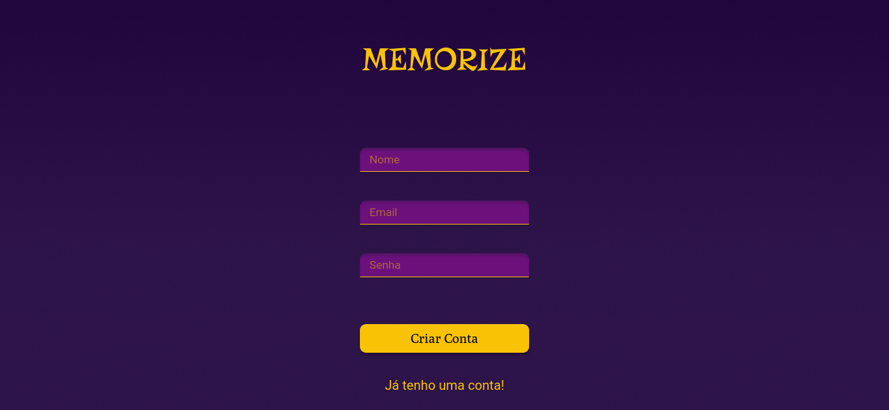
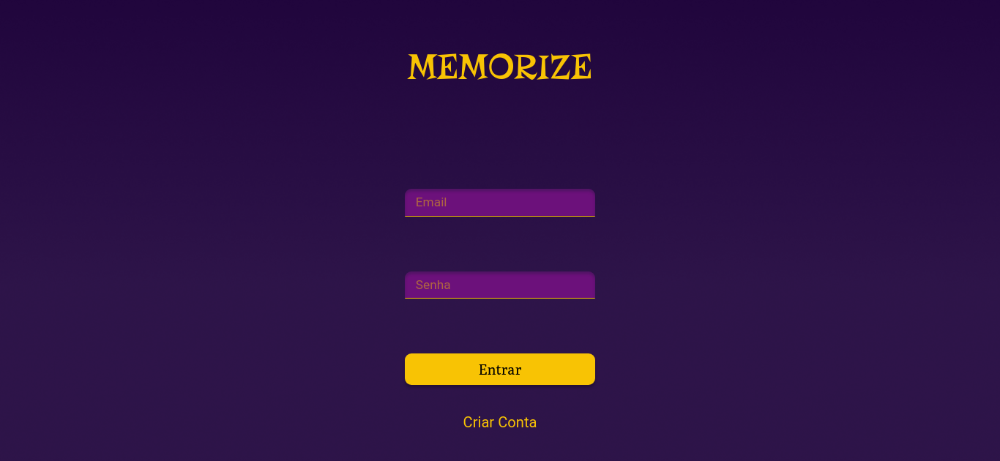
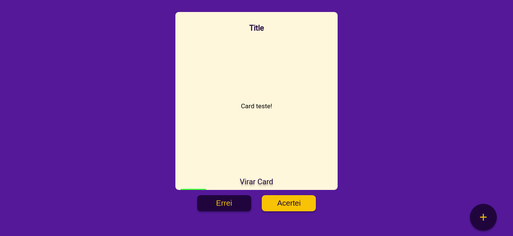
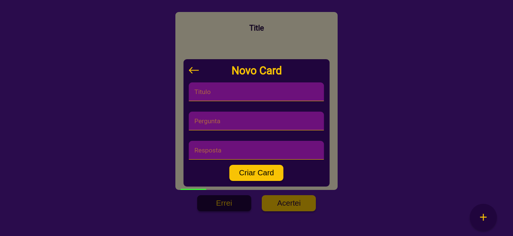
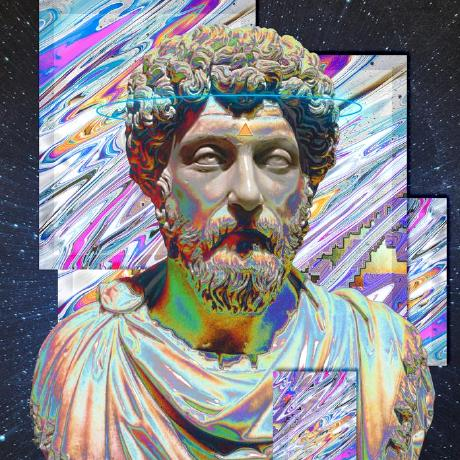

<div align="center">
   
  &nbsp
   
  &nbsp
  
</div>

---

## Tabela de conteúdos

<!--ts-->
   * [Sobre](#sobre)
   * [Funcionalidades](#funcionalidades)
   * [Demonstração](#demonstração)
   * [Instalação](#instalação)
      * [Pré-requisitos](#pré-requisitos)
      * [Como usar](#como-usar)
   * [Tecnologias utilizadas](#tecnologias)
   * [Contribuidores](#contribuidores)
   * [Autores](#autores)
<!--te-->

---

## Sobre

> Memorize é um projeto completo de um site sobre *Flashcards*, ele foi produzido com o intuito de juntar um time e construir um projeto completo, tanto no login, registro, Interface de Usuário (UI) e Experiência do Usuário (UX) quanto na analise de mercado. 
> No planejamento do projeto foi posto como objetivo que ele seja facil de usar, rápido de revisar, prático e eficiênte, para isso além de toda a interface simples também foi criado um [algoritmo de revisão](https://github.com/Studio-024/revison-algorithm) que vai ordenar os cards pela ordem de prioridade de revisão.

---

## Funcionalidades

[](#criação-de-cards)
[](#revisão-dos-cards)
[](https://github.com/Studio-024/revison-algorithm)
[](#revisão-dos-cards)
[](#cadastro-de-usuário)
[](#login-de-usuário)

---

## Demonstração

<div align="center">
  
  ### Cadastro de usuário
  
  <br/>
  
  ### Login de usuário
  
  <br/>
  
  ### Revisão dos cards
  
  <br/>
  
  ### Criação de cards
  
  <br/>
  
</div>

---

## Instalação
Nesse capitulo vamos te mostrar como rodar essa aplicação na sua máquina!

### Pré-requisitos

- Você precisa ter o Yarn ou o npm instalados na sua maquina para iniciar a aplicação em geral;
- Você precisa ter o NodeJS instalado na sua maquina para a aplicação em geral;
- Você precisa ter o Git instalado na sua maquina para conseguir instalar o repositorio;
- Você precisa ter o Xampp instalado em sua maquina para iniciar o Banco de Dados.


### Como usar

Após já ter completado os pré-requisitos você deverá abrir o terminal/cmd da sua maquina e digitar:
```
git clone https://github.com/Studio-024/memorize.git
```
Agora você já tem todos os arquivos em sua maquina! Agora entre na pasta do projeto:
```
cd memorize;
```
Instale as dependencias da raiz do projeto:
```
yarn install
```
Vamos ligar o servidor primeiro, vamos para a pasta server:
```
cd server;
```
Instale as dependencias do server:
```
yarn install
```
Inicie o banco de dados:
```
yarn db:start
```
Agora você tem que abrir um novo terminal ou cmd pra deixar ele rodando a API:
```
yarn dev
```
A  API e o banco de dados estão ativado! Agora vamos voltar para a pasta raiz do projeto:
```
cd ..
```
Entre na pasta *Client*:
```
cd client
```
Instale as dependencias:
```
yarn install
```
Vamos ativar o client agora:
```
yarn start
```
Espere um pouco até abrir uma nova aba do seu navegador com a URL `http://localhost:3000` ou coloque essa URL direto em seu navegador, espere um pouco e o projeto estará funcionando!


---
## Tecnologias

  ### Ferramentas Gerais
   
  
   
  
  ### Frameworks
   
   
       
   
   
   
  
---
## Contribuidores

<table>
<tr >
  <td width="200px" align="center">
    
   
    
  #### Nicolas Fernando Matsdorf Kisner
  [](https://www.instagram.com/nicolas_matsdorf/?utm_medium=copy_link)
  </td>
</tr>
</table>

---
## Autores

<table>
<tr >
  <td width="200px" align="center">
    
   
    
  #### Alexandre Costa Belettini
  [](https://www.linkedin.com/in/alexandrexyz/)
    <br>
  [](https://github.com/AlexandreXYZ)
  </td>

  <td width="200px" align="center">
  
   

  #### Pedro Otávio Furtado Duarte 
  [](https://www.linkedin.com/in/pedro-duarte-5b5356214/)
    <br>
  [](https://github.com/k1vz)
    
  </td>

  <td  width="200px"align="center">
    
   

  #### Vinicius Gregorine Menegon
  [](https://www.linkedin.com/in/vinicius-gregorine-menegon-92428b210/)
    <br>
  [](https://github.com/ViniciusGregorine)
  </td>

</tr>
</table>
